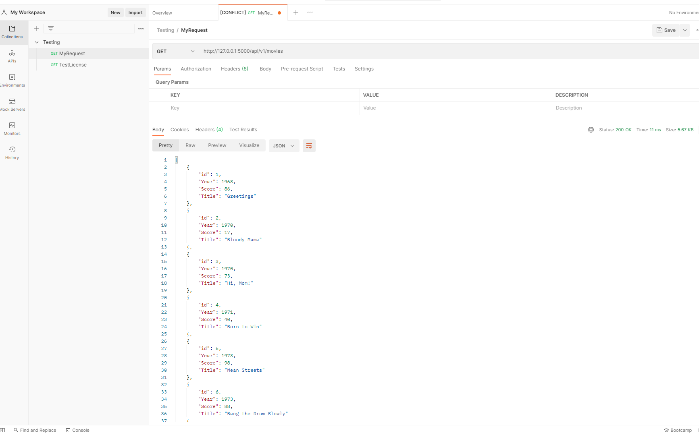
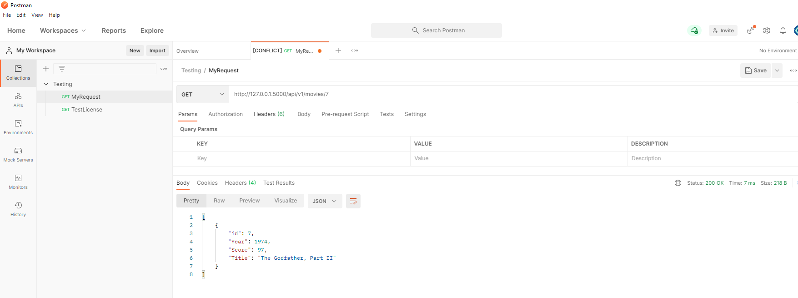
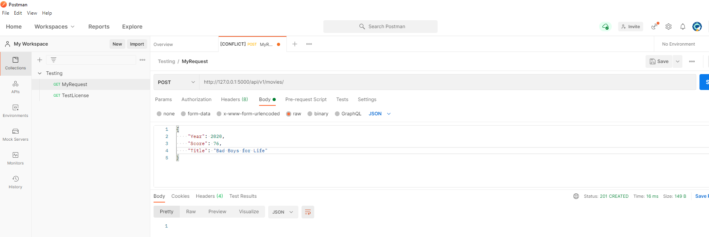
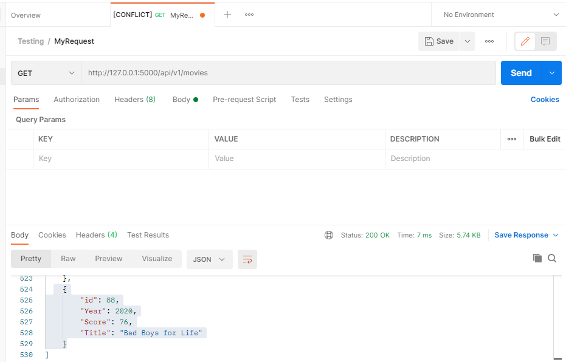
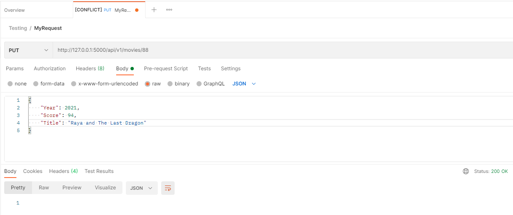
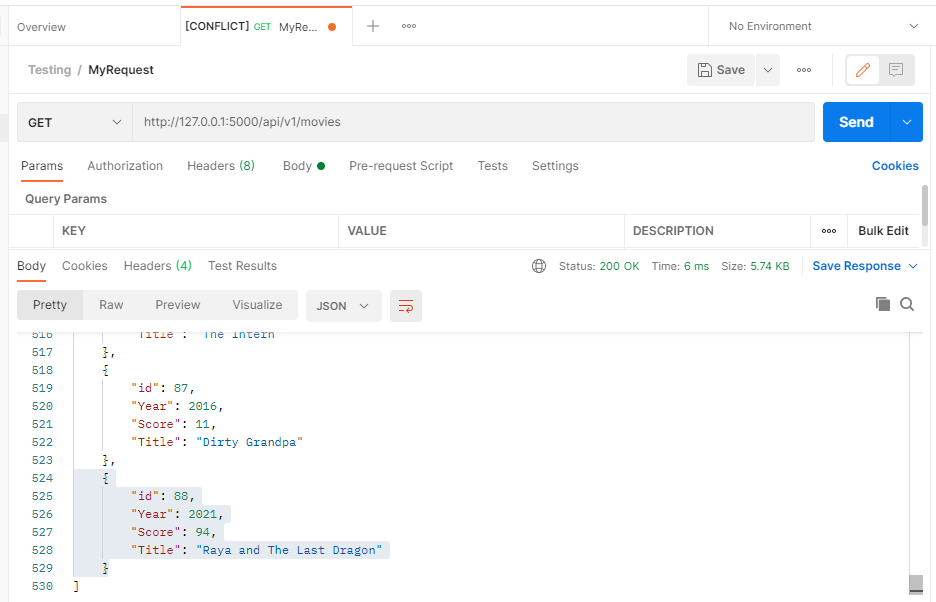
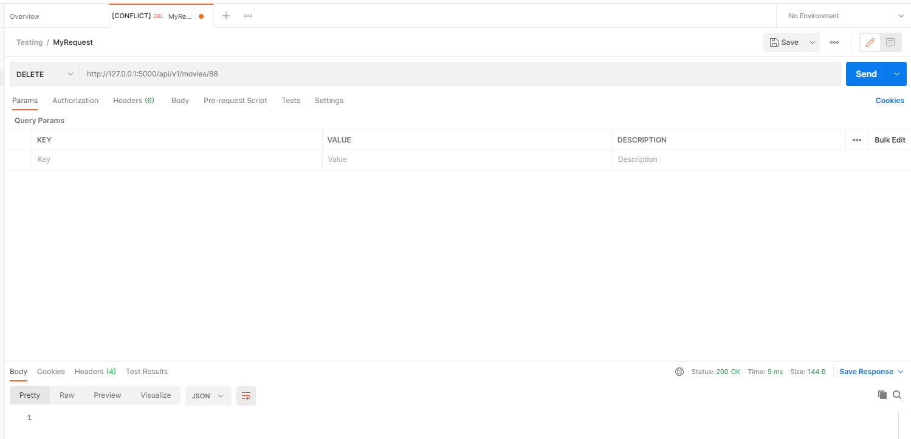
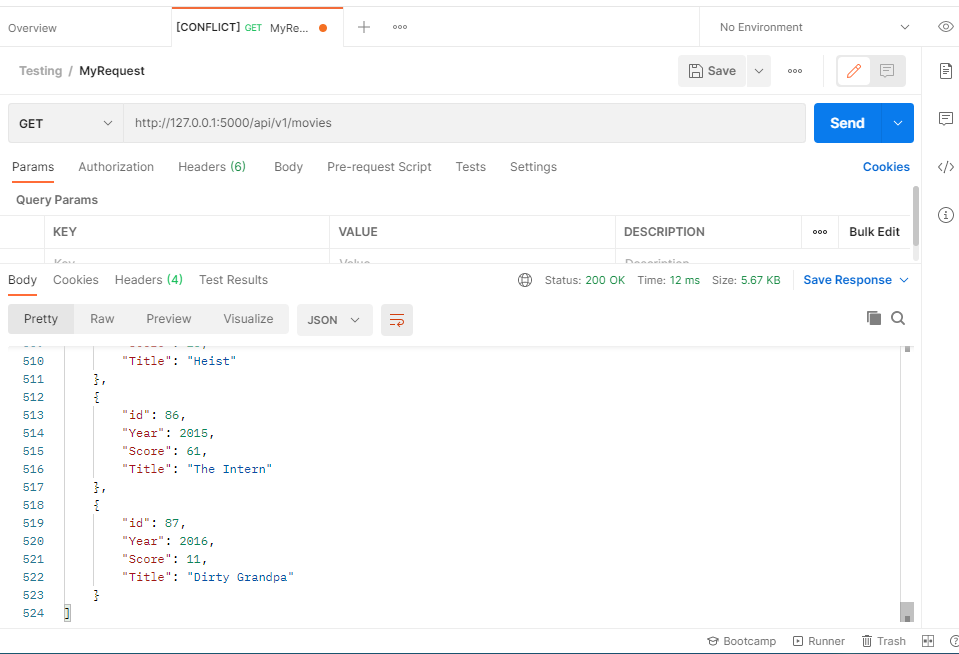

# Project Description
This project is a homework assignment to teach how to get PyCharm setup with Docker, Flask, MySQL and Postman

# All Records in Postman

# One Record in Postman

# Create Record in Postman

# Edit Record in Postman

# Delete Record in Postman

