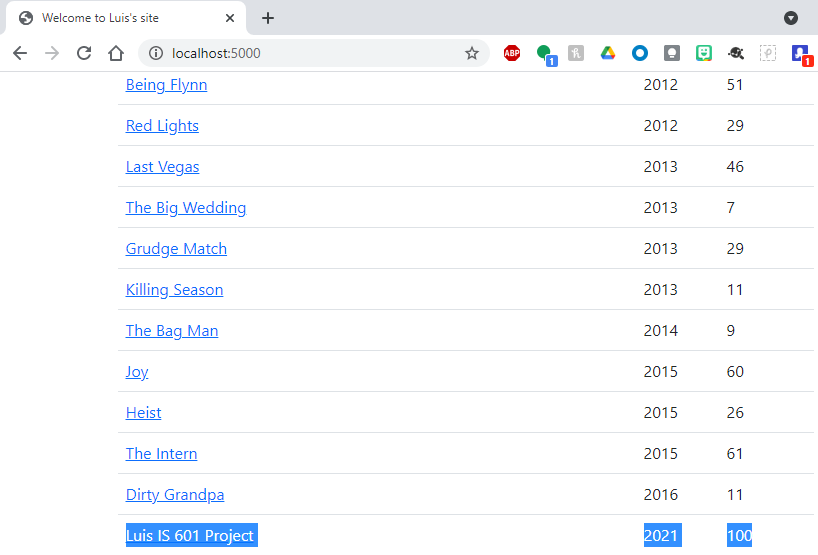

# Project Description
This project is a homework assignment to teach how to get PyCharm setup with Docker, Flask, MySQL and Postman

# PyCharm Table Screenshot

# Homepage Screenshot

# View of One Record Screenshot

# Add New Record Screenshot

# Update Record Screenshot

# Delete Record Screenshot

